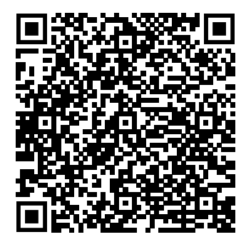

# Bitcoin: A Work in Progress

<!-- This text is also used on the back cover -->

With thousands of “crypto” projects out there, they say Bitcoin is old and boring, but nothing could be further from the truth. This book will guide you through the latest developments in Bitcoin, as seen through the eyes of one of its many developers.

You'll learn about the latest soft fork known as Taproot, the challenges of keeping open source software free of money-stealing bugs and malware, new ways to protect nodes against evildoers on the internet, how to deal with the ever-growing blockchain, and more!

Each chapter links to a corresponding episode of the [_Bitcoin, Explained_](https://podcastindex.org/podcast/3307835) podcast. The book also links to more than two hundred articles, videos, podcasts, and even the source code. And thanks to a tiny QR code next to every link, you'll never have to type long URLs.

# The Author

<!-- This text is also used on the back cover -->

{: width="150" : style="float: right"}

The author is a software developer based in Utrecht, The Netherlands. He has been working in the Bitcoin industry since 2014 and became a Bitcoin Core contributor in 2017, giving him a front row seat to all the latest and most exciting technical developments. He is a co-host on the _Bitcoin Magazine_ podcast _Bitcoin, Explained_.

# Buy Now

Find the book at your favorite online retailer, order it from your local book store, or try one of the links below.

* Netherlands and Belgium: [bol.com](https://www.bol.com/nl/nl/p/bitcoin-a-work-in-progress/9300000097695614/)
* USA: [Barnes & Noble](https://www.barnesandnoble.com/w/bitcoin-sjors-provoost/1141408481), [Amazon](https://www.amazon.com/dp/9090360425)
* Canada: [Amazon.ca](https://www.amazon.ca/Bitcoin-Technical-innovations-Sjors-Provoost/dp/9090360425)
* UK: [Amazon.co.uk](https://www.amazon.co.uk/Bitcoin-Technical-innovations-Sjors-Provoost/dp/9090360425/), [Book Depository](https://www.bookdepository.com/Bitcoin-Sjors-Provoost/9789090360423)
* [Norway](https://www.adlibris.com/no/bok/bitcoin-technical-innovations-from-the-trenches-9789090360423), [Sweden](https://www.adlibris.com/se/bok/bitcoin-technical-innovations-from-the-trenches-9789090360423), [Finland](https://www.adlibris.com/fi/kirja/bitcoin-technical-innovations-from-the-trenches-9789090360423) at Adlibris
* Denmark: [Saxo](https://www.saxo.com/dk/bitcoin-technical-innovations-from-the-trenches_bog_9789090360423)
* France: [Amazon.fr](https://www.amazon.fr/Bitcoin-Technical-innovations-Sjors-Provoost/dp/9090360425) ([Amazon.de](https://www.amazon.de/-/de/dp/9090360425) may be cheaper)
* Italy: [Amazon.it](https://www.amazon.it/Bitcoin-Progress-Technical-innovations-trenches/dp/9090360425/)  ([Amazon.de](https://www.amazon.de/-/de/dp/9090360425) may be cheaper)
* Spain: [Amazon.es](https://www.amazon.es/Bitcoin-Technical-innovations-Sjors-Provoost/dp/9090360425)
* Turkey: [Ubuy](https://www.ubuy.com.tr/en/product/4XF8KHKA8-bitcoin-technical-innovations-from-the-trenches)
* India: [Amazon.in](https://www.amazon.in/dp/9090360425)
* Brazil: [Amazon.com.br](https://www.amazon.com.br/s?k=9789090360423)
* Korea: [Yes24](http://www.yes24.com/product/goods/109180444), [Kyobo](https://www.kyobobook.co.kr/product/detailViewEng.laf?ejkGb=BNT&mallGb=ENG&barcode=9789090360423), [Aladin](https://www.aladin.co.kr/shop/wproduct.aspx?ItemId=294118397)
* Hong Kong: [Ubuy](https://www.ubuy.hk/en/product/4XF8KHKA8-bitcoin-technical-innovations-from-the-trenches) and [Amazon.com](https://www.amazon.com/dp/9090360425) both ship from USA, [Book Depository](https://www.bookdepository.com/Bitcoin-Sjors-Provoost/9789090360423) ships from UK
* Singapore: [Amazon.sg](https://www.amazon.sg/Bitcoin-Technical-innovations-Sjors-Provoost/dp/9090360425)
* Taiwan: [Amazon.com](https://www.amazon.com/dp/9090360425) ships from USA, [Book Depository](https://www.bookdepository.com/Bitcoin-Sjors-Provoost/9789090360423) from UK
* Vietnam: [Ubuy](https://www.ubuy.vn/en/product/4XF8KHKA8-bitcoin-technical-innovations-from-the-trenches)  ships from USA
* Australia: [Booko.com.au](https://booko.com.au/9789090360423) various options, including [Amazon.com.au](https://www.amazon.com.au/dp/9090360425), but tends to ship from UK

For other countries try [Amazon.com](https://www.amazon.com/dp/9090360425) or [Book Depository](https://www.bookdepository.com/Bitcoin-Sjors-Provoost/9789090360423); they ship to many places. However, it may be better to wait a few days for a web shop closer to your location. This is especially true for mainland Europe, Australia and some countries in Asia. I'll keep updating this page.

[Let me know](mailto:sjors@sprovoost.nl) if you find better options than the ones suggested above.

The book is also available through the [Espresso Book Machine](https://net.ondemandbooks.com/odb/lsi/9789090360423) at various locations.

# Preview

Here's the [table of contents and Chapter 1](preview.pdf){:target="_blank"}.

# Buy Soon(tm)

Sales pages have cropped up in more countries, but the book showed as unavailable last time I checked:

* Germany: [Amazon.de](https://www.amazon.de/-/de/dp/9090360425)
* Japan: [Amazon.co.jp](https://www.amazon.co.jp/Bitcoin-Technical-innovations-Sjors-Provoost/dp/9090360425)

The book should be available soon(tm) in the UK, USA, Canada, most of the EU and various places in Asia. Try searching for the ISBN number `9789090360423`.

# When E-Book?

I'd like to get more physical copies safely distributed across the globe before selling an electronic version. You can make one yourself though: just clone the Github repository and run: `./make-book.sh --paperback` (see [README](https://github.com/sjors/nado-book#readme) for more details)

# Media appearances

* BNR Cryptocast 218 B: [Hoe kwetsbaar is bitcoin?](https://www.bnr.nl/podcast/cryptocast/10474959/218-b-hoe-kwetsbaar-is-bitcoin) (2022-05-03, Dutch)

# Tip jar

## Lightning Address

Just copy `sjors@bitrefill.me` and paste it into a [compatible wallet](https://github.com/andrerfneves/lightning-address/blob/master/README.md#wallets-supported). Learn more at [lightningaddress.com](https://lightningaddress.com).

## Bolt 12

The [Bolt 12](https://bolt12.org) draft standard is currently only supported by [c-lightning](https://github.com/ElementsProject/lightning#core-lightning-cln-a-specification-compliant-lightning-network-implementation-in-c). Add a line `experimental-offers` to `~/.lightning/config` and then use `lightning-cli pay ln01p... 42sat`.

<pre  style="white-space: nowrap; overflow: hidden; text-overflow: ellipsis; width: 300px;">lno1pg34g6tsypnx7u3qgf5hgcm0d9hr5gzpyptk7untyp5kugzswfhkwun9wde3grjndfhhyueq2pex7an0daehg83qxalcjym827wseh7zsvauxgap6q23fm4yp4yve6rdx83esg37pjelqsqk0mxa75uwy2j8qpyce7vet0xn8vfq4yjq02r4rly6agvhy0jvqp2r0cdl6fsl3qu72jf5wvlr3hgkmzlgg5ezut4q9z50saxvnaqtq</pre>

