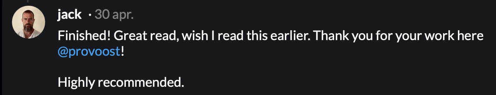

# Bitcoin: A Work in Progress

<!-- This text is also used on the back cover -->

With thousands of “crypto” projects out there, they say Bitcoin is old and boring, but nothing could be further from the truth. This book will guide you through the latest developments in Bitcoin, as seen through the eyes of one of its many developers.

You'll learn about the latest soft fork known as Taproot, the challenges of keeping open source software free of money-stealing bugs and malware, new ways to protect nodes against evildoers on the internet, how to deal with the ever-growing blockchain, and more!

The book links to more than two hundred articles, videos, podcasts, and even the source code. And thanks to a tiny QR code next to every link, you'll never have to type long URLs.

# Mailinglist

Join the Bitcoin Work in Progress mailinglist to receive content from the book in small bites, with some added thoughts from the author.

<form method="post" action="https://list.btcwip.com/subscription/form" class="listmonk-form">
    

        <input type="hidden" name="nonce" />
        

          <input type="email" name="email" required placeholder="E-mail" />
          <input id="476d7" type="checkbox" hidden name="l" checked value="476d7a6f-fffb-4196-ba7d-5d93095f4210" />
          <input type="submit" value="Subscribe" />
        

        

            

            
        

    

</form>

You can also [read the archive](https://list.btcwip.com/archive) or subscribe via [RSS](https://list.btcwip.com/archive.xml).

# Podcast

The book is based on the [_Bitcoin, Explained_](https://podcast.sprovoost.nl/@nado/episodes) podcast, where you'll learn something new about Bitcoin every couple of weeks.

# Endorsements

"Great read, wish I read this earlier." - [Jack Dorsey](https://iris.to/note19pkjwhnu2w8ekssxn2nrd38pj0ekhx07nu2j2mwl4u7nqm34lsjqs3jtcd)
# The Author

<!-- This text is also used on the back cover -->

{: width="150" : style="float: right"}

The author is a software developer based in Utrecht, The Netherlands. He has been working in the Bitcoin industry since 2014 and became a Bitcoin Core contributor in 2017, giving him a front row seat to all the latest and most exciting technical developments. He is a co-host on the _Bitcoin Magazine_ podcast _Bitcoin, Explained_.

# Table of Contents

A few chapters can be read online for free, others can be purchased as a printer friendly PDF (⚡ only).

1. Bitcoin Addresses: [Blog Post](https://sprovoost.nl/2022/11/10/what-is-a-bitcoin-address/) \| [Buy PDF](https://shop.purpledunes.com/product/btcwip-chapter-1-bitcoin-addresses/)
2. DNS Bootstrap and Tor V3: [Buy PDF](https://shop.purpledunes.com/product/chapter-2-dns-bootstrap/)
3. SegWit: [Buy PDF](https://shop.purpledunes.com/product/btcwip-chapter-3-segwit/)
4. libsecp256k1: [Buy PDF](https://shop.purpledunes.com/product/chapter-4-libsecp256k1/)
5. Sync Time and AssumeUTXO: [Buy PDF](https://shop.purpledunes.com/product/btcwip-chapter-5-blockchain-sync-assumeutxo/)
6. Utreexo: [Buy PDF](https://shop.purpledunes.com/product/btcwip-chapter-6-utreexo/)
7. Eclipse Attacks: [Blog Post](https://sprovoost.nl/2022/05/12/attacking-bitcoin-eclipse-attacks/) \| [Buy PDF](https://shop.purpledunes.com/product/btcwip-chapter-7-eclipse-attacks/)
8. Fake Nodes: [Buy PDF](https://shop.purpledunes.com/product/btcwip-chapter-8-fake-nodes/)
9. Guix - Why Open Source Matters: [BitMEX Research blog](https://blog.bitmex.com/why-open-source-matters-guix/) \| [Buy PDF](https://shop.purpledunes.com/product/btcwip-chapter-9-guix/)
10. Script, P2SH, and Miniscript: [Buy PDF](https://shop.purpledunes.com/product/btcwip-chapter-10-miniscript/)
11. Taproot and Schnorr
12. Soft Fork Activation Options

# Buy Now

## Online

Find the book at your favorite online retailer, probably [Amazon](https://www.amazon.com/Bitcoin-Technical-innovations-Sjors-Provoost/dp/9090360425).

Pay with Bitcoin:
* EU: [shopinbit.com](https://shopinbit.com/books/english-books/computing-internet/investing-and-finance-online/515003/bitcoin-technical-innovations-from-the-trenches-sjors-provoost)

## Physical shops

* Amsterdam: The American Book Center ([Spui 12](https://goo.gl/maps/TzoYnznXgWTMgVRY7)) can print [the book](https://abc.nl/book-details/bitcoin/$9789090360423), sometimes even while you wait!

I'm not aware of any physical book store that has the book on a shelf, but in many countries they can order it for you. ISBN: `9789090360423`

## eBook

Don't like dead trees? You can [buy the e-book](https://shop.purpledunes.com/product/bitcoin-a-work-in-progress-ebook/) from me in `.epub` or `.pdf` format (pay with Bitcoin). It's also for sale in the [Kobo](https://www.kobo.com/nl/nl/ebook/bitcoin-a-work-in-progress) store, [Barnes & Noble](https://www.barnesandnoble.com/w/bitcoin-sjors-provoost/1141629678?ean=2940186716105) (NOOK), [Apple Books](http://books.apple.com/us/book/id6442926150) and [Google Books](https://play.google.com/store/books/details?id=mHlzEAAAQBAJ), but not in the Kindle store due to [absurdly low royalties](https://sprovoost.nl/2022/06/01/amazon-and-the-dystopian-future-of-book-censorship/#kindle-royalties).

## Contact

* Email: [sjors@sprovoost.nl](mailto:sjors@sprovoost.nl)
* Nostr: `npub1s6z7hmmx2vud66f3utxd70qem8cwtggx0jgc7gh8pqwz2k8cltuqrdwk4c`
* Twitter: [@provoost](https://twitter.com/provoost)
* Blog: [sprovoost.nl](https://sprovoost.nl)

# Media appearances

* BNR Cryptocast 218 B: [Hoe kwetsbaar is bitcoin?](https://www.bnr.nl/podcast/cryptocast/10474959/218-b-hoe-kwetsbaar-is-bitcoin) (2022-05-03, Dutch)

# Tip jar

## Lightning Address

Scan the QR or copy <a href="lightning://sjors@sprovoost.nl">sjors@sprovoost.nl</a> and paste it into a <a href="https://github.com/andrerfneves/lightning-address/blob/master/README.md#wallets-supported">compatible wallet</a>. Learn more at <a href="https://lightningaddress.com">lightningaddress.com</a>.

## Bolt 12

The <a href="https://bolt12.org">Bolt 12</a> draft standard is currently only supported by <a href="https://github.com/ElementsProject/lightning#core-lightning-cln-a-specification-compliant-lightning-network-implementation-in-c">c-lightning</a>. Add a line <code>experimental-offers</code> to <code>~/.lightning/config</code> and then use <code>lightning-cli pay ln01p... 42sat</code>.

    

        <pre class="copy-target bolt12">lno1pg5ygmmwv96xjmmwypnx7u3qgf5hgcm0d9hr5gzpyptk7untyp5kugzswfhkwun9wde3yrjndfhhyueq2pex7an0daehg93pqvmhlzgnvate6rxlc2pnhser58gp298w5sx53n8gd5c78xpz8cxtx</pre>
    

    <button class='copy-code-button' />

