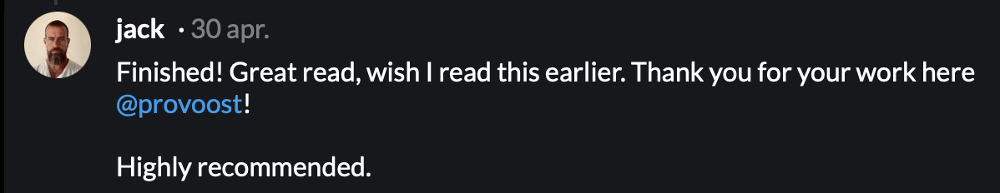

# Bitcoin: A Work in Progress

<!-- This text is also used on the back cover -->

With thousands of “crypto” projects out there, they say Bitcoin is old and boring, but nothing could be further from the truth. This book will guide you through the latest developments in Bitcoin, as seen through the eyes of one of its many developers.

You'll learn about the latest soft fork known as Taproot, the challenges of keeping open source software free of money-stealing bugs and malware, new ways to protect nodes against evildoers on the internet, how to deal with the ever-growing blockchain, and more!

The book links to more than two hundred articles, videos, podcasts, and even the source code. And thanks to a tiny QR code next to every link, you'll never have to type long URLs.

## Podcast

The book is based on the [_Bitcoin, Explained_](https://podcast.sprovoost.nl/@nado/episodes) podcast, where you'll learn something new about Bitcoin every couple of weeks.

## Endorsements

"Great read, wish I read this earlier." - [Jack Dorsey](https://iris.to/note19pkjwhnu2w8ekssxn2nrd38pj0ekhx07nu2j2mwl4u7nqm34lsjqs3jtcd)
## The Author

<!-- This text is also used on the back cover -->

{: width="150" : style="float: right"}

The author is a software developer based in Utrecht, The Netherlands. He has been working in the Bitcoin industry since 2014 and became a Bitcoin Core contributor in 2017, giving him a front row seat to all the latest and most exciting technical developments. He is a co-host on the _Bitcoin Magazine_ podcast _Bitcoin, Explained_.

## Buy Now



## Table of Contents

A few chapters can be read online for free, others can be purchased as a printer friendly PDF for &euro;0.99 (&#9889; only).

<ol class="chapter-list">
  <li>
    

      Bitcoin Addresses: <a href="https://sprovoost.nl/2022/11/10/what-is-a-bitcoin-address/">Blog Post</a>
      
    

  </li>
  <li>
    

      DNS Bootstrap and Tor V3
      
    

  </li>
  <li>
    

      SegWit
      
    

  </li>
  <li>
    

      libsecp256k1
      
    

  </li>
  <li>
    

      Sync Time and AssumeUTXO
      
    

  </li>
  <li>
    

      Utreexo
      
    

  </li>
  <li>
    

      Eclipse Attacks: <a href="https://sprovoost.nl/2022/05/12/attacking-bitcoin-eclipse-attacks/">Blog Post</a>
      
    

  </li>
  <li>
    

      Fake Nodes
      
    

  </li>
  <li>
    

      Guix - Why Open Source Matters: <a href="https://blog.bitmex.com/why-open-source-matters-guix/">BitMEX Research blog</a>
      
    

  </li>
  <li>
    

      Script, P2SH, and Miniscript
      
    

  </li>
  <li>
    

      Taproot and Schnorr
      
    

  </li>
  <li>
    

      Soft Fork Activation Options
      
    

  </li>
</ol>

## Contact

* Email: [sjors@sprovoost.nl](mailto:sjors@sprovoost.nl)
* Nostr: [npub...](https://njump.me/npub1v25jqj332n630klwtqeqxgyrjl4alw4phmluhu2x6lcxzwy9m03suqexw3)
* Blog: [sprovoost.nl](https://sprovoost.nl)
